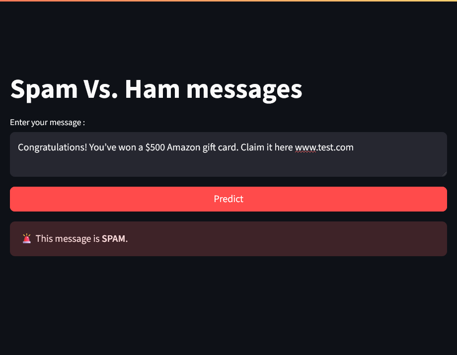

# 🧠 Spam/Ham Message Detector – ML & NLP techniques

This project is a simple web interface to classify messages as spam or ham using ML and NLP techniques.

--- 
## 📸 Screenshot

---

## 🚀 Live Demo  
👉 [Live App on Render](https://spam-detector-abtc.onrender.com/) 

---

## 📦 Features

- Real-time spam detection from text input
- Simple and interactive Streamlit interface

---

## ⚙️ Tech Stack

| Component     | Description                                  |
|---------------|----------------------------------------------|
| Backend       | Python, Scikit-learn, Transformers, SpaCy    |
| Frontend      | Streamlit                                    |
| NLP Tools     | `nltk`, `spacy`, `transformers`              |
| ML Model      | Xgboost, Naive bayes, Random forest                        |
| Deployment    | Docker, Render.com                           |

---

## 📚 What I Learned

Throughout this project, I had the opportunity to reinforce and apply several key concepts in machine learning and natural language processing:

- 🔁 **Revisited classification algorithms**: XGBoost, Naive Bayes, and Random Forest.
- 🏗️ **Feature engineering**: Created new custom features to enhance model performance.
- 🧼 **Text preprocessing techniques**: Tokenization, stopword removal, punctuation stripping, etc.
- 🧠 **Text embeddings**: Used Word2Vec with Skip-Gram architecture to represent text semantically.
- 📊 **Model evaluation**: Kfold validation, evaluation metrics: Accuracy, F1-score, Precision, Recall, and Confusion Matrix.
- 🗃️ **Model management**: Trained, saved, and reused ML models efficiently.
- 🌐 **App deployment**: Built and deployed a fully working Streamlit web app using Docker and Render.
- 📈 **Visualization**: Barcharts and wordcloud.

---

## 🧪 Model Performance

After evaluating several classifiers, the XGBoost model delivered the best results:

- 🎯 **XGBoost Accuracy**: 99%
- Other models tested: Naive Bayes, Random Forest
- Evaluated using metrics like **Precision**, **Recall**, **F1-Score**, and **Confusion Matrix**

--- 

